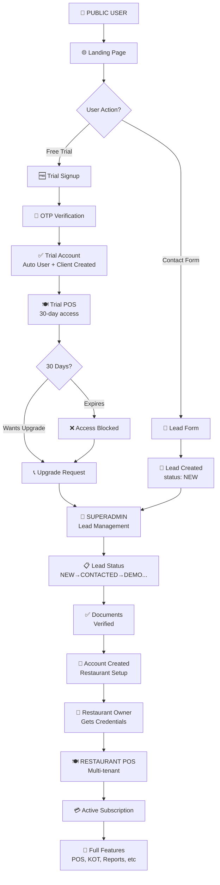
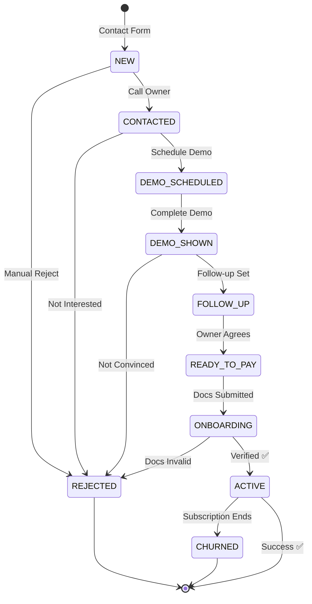
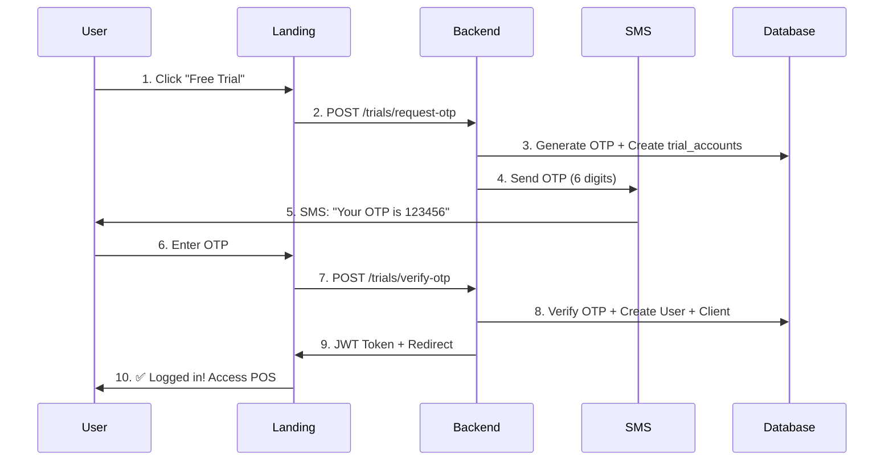
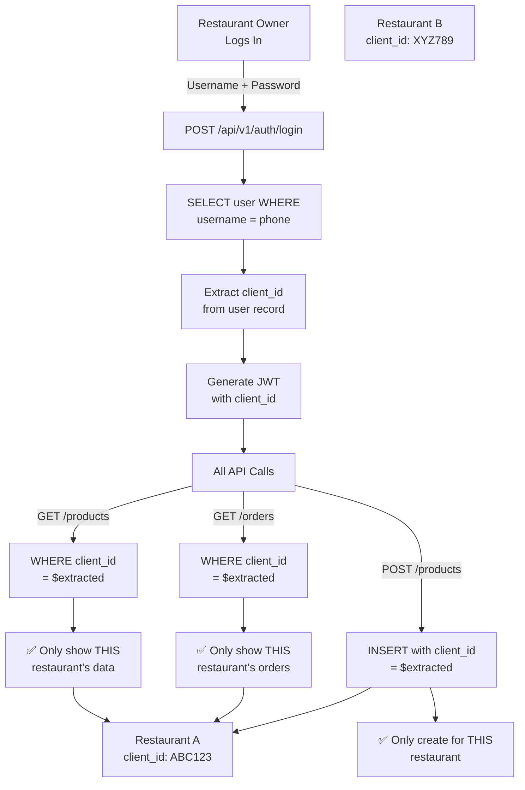
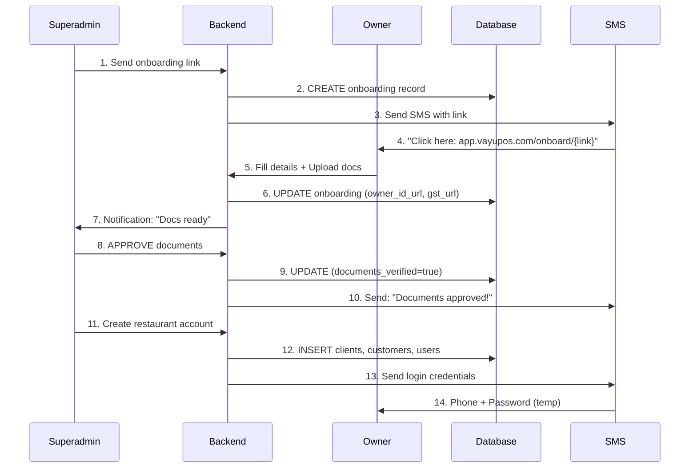
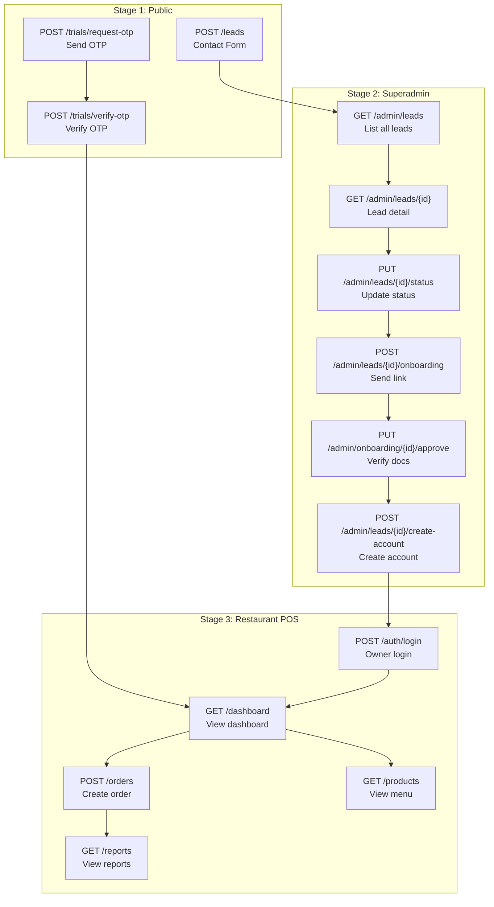
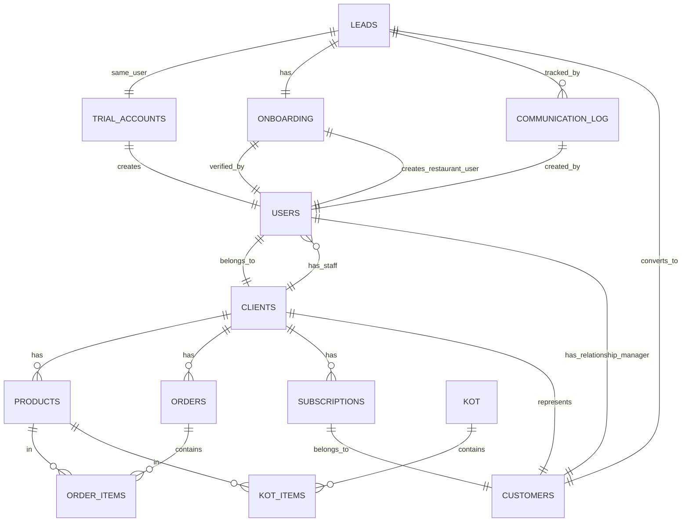
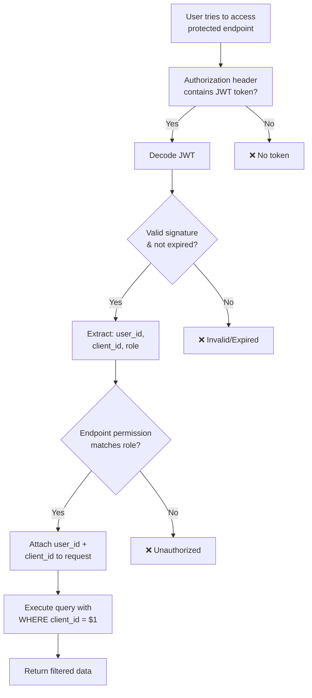
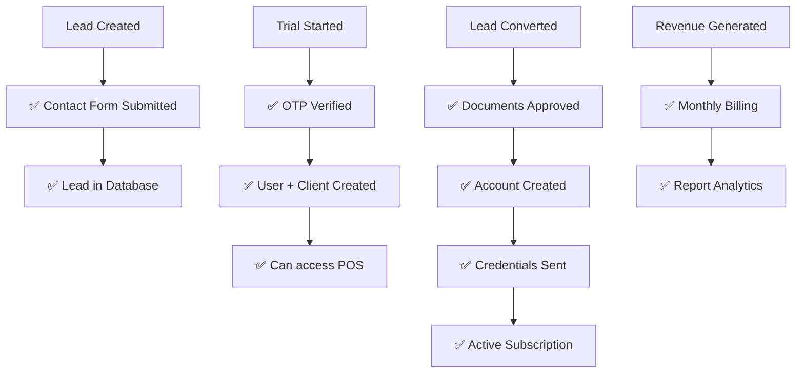

# VayuPOS System Flow - Visual Diagrams

## 1️⃣ Complete User Journey (4 Stages)

## 2️⃣ Lead Management Status Workflow

## 3️⃣ Landing Page → Lead → Superadmin Loop

```mermaid
graph LR
    A["🌐 app.vayupos.com<br/>Landing Page"]
    B["📝 Contact Form<br/>Restaurant Name,<br/>Owner, Phone, Email"]
    C["💾 INSERT leads<br/>status=NEW"]
    D["👔 Superadmin<br/>Dashboard"]
    E["📞 Assign Salesperson<br/>Schedule Demo"]
    F["📋 Track Communication<br/>Add Notes"]
    G["✅ Documents<br/>Verify"]
    H["🎫 Create<br/>Restaurant Account"]
    I["🍽️ POS Access<br/>Login Creds Sent"]
    
    A -->|Submit| B
    B -->|POST /api/v1/leads| C
    C -->|Notification| D
    D -->|Manage Lead| E
    E --> F
    F --> G
    G --> H
    H -->|SMS| I
```

## 4️⃣ OTP Trial Account Flow

## 5️⃣ Multi-Tenant Data Isolation

## 6️⃣ Document Upload & Verification

## 7️⃣ Complete Data Flow - API Calls

## 8️⃣ Database Schema Relationships

## 9️⃣ Authentication & Authorization

## 🔟 Success Metrics

